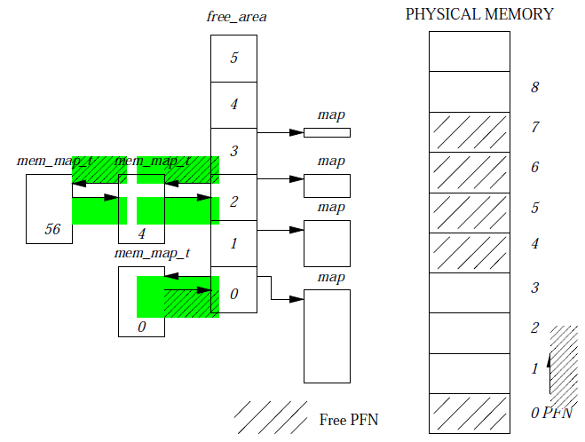

# Memory Management 

Memory on a computer is always a scarse resource. In order for the processes running on the computer
to work effectively there needs to be a memory management system that can effectively distribute the
resource among all the competing processes. The virtual memory mechanism is the most popular method
of doing so. 

There are several benefits to having virtual memory system: 

* Large Address Space - This mechanism gives the operating system the illusion that it has much more
  memory than it actually does.
* Protection - as all process have a unique address space in which they operate there is no chance
  for process interfering with the operations of one another. 
* Memory Mapping - this allows for the contents of the file to be directly linked to the address
  space of the process. 
* Fair physical memory allocation - The virtual memory scheme gives each process a fair share of the
  memory resource. 
* Shared virtual memory - Generally most processes will have their own address spaces but there are
  time when sharing memory is necessary specially when the code from dynamic libraries is used in
  several process. Shared memory can also be used as IPC (inter process communication). 

## 1. Asbstract memory model of Virtual Memory 

 

A Process to execute any process is either reading instructions from memory or writing data to
memory. In order to do this the process needs to have a good idea as to how to access memory. 

In the virtual memory system all addresses that that processor sees are virtual addresses. The
virtual addresses created have to be translated to actual physical memory addresses and that is
done by using a data structure called the page table which is maintained by the operating system. 

The processes are divided into blocks of memory called pages and for an OS this page size is fixed
either 8 or 4 Kb. The blocks (virtual memory address) is made up of an offset and a page frame
number. The offset and the PFN together uniquely can identify the page that we are looking for. Once
the page identifier is found the processor looks up the page table to get the actual physical memory
where the instructions lie. 

**Page Fault** - as we said earlier physical memory is limited and there are more virtual memory
addresses tha physical ones therefore in order to manage such a scenario the OS will from time to
time move the process pages out of physical memory, as a result there will be many virtual memory
addresses that will not have a physical address. When such a page is demanded by a process of the
processor it ends in a condition called page fault (where physical memory translation is not
successful). The page fault condition ends up as an interrupt which the OS will handle by looking
for the virtual page (on swap area on disk) and loading the page to the main memory. 

In the diagram above we can see that proces X and Y share the physical memory locations and each
process has a page table that can be used for translation of the address. 

Another important implication of the page table data structure is that pages of processes do not
have to be any particular order in the main memory making the management of the process easier as
well as optimizes the uses of main memory. 

### 1.1 Demand Paging 

As was explained in the concept of page fault not all pages of a process can be brought into the
physical memory are and therefore the process of keeping the most used pages in physical memory and
letting the least used one out of memory is called demand paging. 

When the memory that the process is request can fail to translate into a physical address due to 2
reasons: 
1. The virtual address is invalid or wrong. In this case the processor will terminate the process as
   it is trying to access memory that it is not supposed to. 
2. the virtual address is valid but the page is not present on physical memory which will lead the
   process to load the missing page to main memory. 

Linux used demand paging to load executable images into processes virtual memory. First part of the
executable image is directly mapped to the virtual memory and only as the executable moves forward
are other pages (due to page faults) are mapped to the memory. This allows Linux to not load the
entire executable file to memory. 

### 1.2 Swapping 

In the event of a page fault (explained above) if the physical memory has no more page it can take
in then the operating system has a choice to make i.e. it needs to decide to remove some pages from
the memory to allow the pages that have just been requested. 

For the purpose of deciding which pages to remove from main memory Linux uses the LRU algorithm.
This is used to avoid a condition called _trashing_ which basically occurs when few pages are
consistantly been brought in and beign sent out of memory leading to the processor spending a lot of
time just swapping pages. 

Another important aspect of swapping is _dirty pages_ pages that are present in physical memory are
written to many times by the processor during the excution of the program, as a result if the OS
realizes that the page has been written to and is a candidate to be swapped out of memory it is
marked as a dirty page and written to a swap area on disk. However of a page has not been written to
by an process and has been swapped out it is simply removed from physical memory and later restored
form memory mapping rather than the swap area. 

Old pages are generally (ones that have not been accessed the longest) good candidates for swapping
process. 

### 1.3 Physical and Virtual Addressing modes 

Not all processes are good candidates to run in vitual address mode the best example of this is the
operating system itself. It would be a nightmare scenario if OS has to manage its addresses too
using a page table. Therefore processes like the OS are excempt from virtual memory addressing mode
and therefore follow the physical addressing mode. 

the processor in the physical addressing mode directly accesses the physical memory rather than
consulting the page table to translate the address. 

### 1.4 Access Control 

It is very improtant to have information in the page table entry itself about the processes access
level so that processes can be stopped from performing tasks they are not suppose to. A PTE (page
tabe entry) example is given below: 

 

The flags show above have the following meaning: 

* V - valid, denotes whether the PTE is valid or not. 
* FOE - this flag indicates that when ever the processor runs this page a page fault must occur and
  the processor must pass the control to the operating system. 
* FOW - fault on write - this indicates that a page fault must occur if processor attempts to write
  to this page. 
* FOR - fault on read - same as FOW accept the page fault occurs on read. 
* ASM - address space match - uses to clear some entries in the translation buffer. 
* KRE - code running in kernel mode can only read this page. 
* URE - code running in user mode can only read this page. 
* GH - Granularity 
* KWE - code running in kernel mode can write to this page. 
* UWE - code running in user mode can write to this page. 

* _PAGE_DIRTY - if set the page need to be written to swap file area rather than being discarded on
  removal. 
* _PAGE_ACCESSED - used by Linux to mark a page as having been accessed. 

## 2. Caches 

In order to make the system optimized and work well Linux needs to use caches to hold data in
memory. There are several caches that Linux OS uses. 

* Buffer Cache - This cache is used by the block device drivers and hold data in fixed blocks of
  memory. A good example of block devices is hard disks that hold data in blocks. if data can be
  found in buffer cache then the block devices do not have to accessed. 
* Page Cache - This is used to speed up access to pages of processes that come from images or data
  from disks. 
* Swap Cache - Only modified pages (dirty) pages are saved in the swap file. Pages that have been
  changes by the processor and need to be swapped out of the main memory need to be written to the
  swap file. 
* Hardware cache - And example of a hardware cache is the caching of the page translation from the
  PTE to physical memory in the hardware cache. This is called Translation Look aside buffers. TLB
  is used like just another cache and on certian conditions will be cleared too. 

## 3. Linux Page Tables 

In Linux there are 3 levels of page tables. Each page table accessed contains the page frame number
of the next level page table. To translate the virtual address to the physical address the process
must traverse all three levels on the Page table structure and then get to the offset of the page in
the physical page structure. 

 

## 4. Page allocation and deallocation 

The data structure that is used in the page allocation and deallocation is the mem_map this is
nothing but a list of mem_map_t data structures that represent a single physical page in the system.
The important fields in the mem_map_t structure are: 

1. count - this is the number of users of this page. if the count is greater than one then there are
   more than one people using this page. 
2. age - this field describes the age of the page and it is used to determine which page is evicted
   in case swapping of pages needs to take place. 
3. map_nr - this is the page frame number that the mem_map_t. 

The free_area structure is a doubly linked list queue that keeps a list of all free pages in the
system. The diagram below shows how the free_area is structured and how the free area can be used.  

 

The first element in the free area data structure holds a free page block which is followed by 2
page blocks and so on. 

### 4.1 Page allocation 

Page allocation follows the Buddy algorithm for the allocation of free blocks. The free_area
structure has an array as well as maps linked to each element in the array. 

Each element in the free_area array will have either 1, 2, 4 or 8 blocks of pages assgined therefore
the 0th element in the free_area structure has a page element of size 1 and array element 2 has a
block size of 4 each etc. The map that is liked to each of the free_area element holds all the 
allocated blocks as well.

In order to search for a free block the algorithm will look for the number of pages requested by the
client if appropriate number of pages of the specified size are not found then next higher level of
free blocks are searched and split up to get to the right size. Finally the link to free blocks are
returned to the calling client. 

### 4.2 Page Deallocation 

The page allocation logic is quite fragmenting in nature as free blocks tend to split up based on
how the free blocks are requested. Therefore page deallocation algorithm will try and recombine and
create blocks that are bunched together. 

1. When ever a block is freed the dellocation algorithm will check to see if the neighbouring
   block/page is free on not. 
2. if the block is free then the blocks are recombined to form a larger block. 
3. this process of recombination continues recursively until we find no more blocks we can combine. 

This leads to the creation of as large a memory block of free space as the system will allow. 

## 5 Memory Mapping 

When an executable program or executable image or a shared libraray needs to be linked to a running 
program i.e. brought into the processes virtual memory address space, the file is not brought into
physical memory instead, instead it is linked into the processes virtual memory. The linking of the 
image into the process virtual address space is called memory mapping. 

Every process virtual memory is represented by a mm_struct data stucture. This has information of
the image that is currently executing and has a link to the vm_area_struct data stucture. this has a
reference to the start and end address of the virtual memory and also the set of operations that can
be performed on the virtual memory area. 

