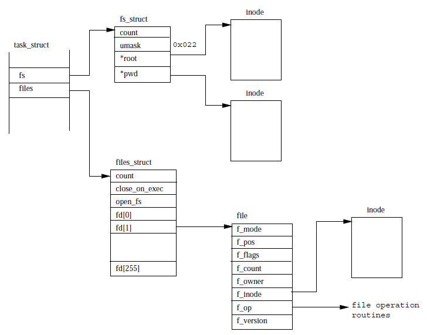
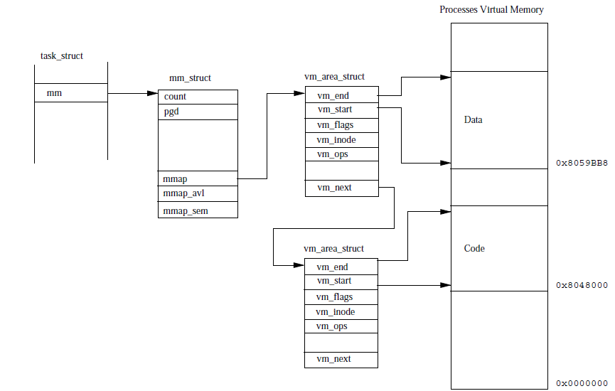

# Processes 

## 1. Linux Processes 

Each process in Linux is represented by a `task_struct` data structure. Each `task_struct` is linked
to a task vector that holds the reference to all process data structures. Processes are broadly of
two types normal and real time. 

There are various attributes that the `task_struct` data stucture has and they are divided into the
following kind: 

* State - this gives the state in which the current process is in there are 4 states
	* Running - this is the state the process in either when it is running or in ready to run
	  state. 
	* Waiting - the process is in this state when it is waiting for some input or other event to
	  occur. The waiting state are of two kinds: 
	  	* Interruptable - this is when the process can be interrupted by signals from the
		  kernel 
		* Uninterruptable - this occurs when the process is waiting on hardware conditions. 
	* Stopped - this is when a process is stopped due to an interrupt e.g. is a process that is
	  debugged can be in stopped state. 
	* Zombie - this is a halted process that for some reason has a `task_struct` on task. this
	  is a dead process. 
* Scheduling - this information is kept in `task_struct` based on this the kernel decided which
  process to schedule next. 
* Identifiers - these are unique identifiers for not only the process but also the user and groups
  that the process has access to. The user and group ids help with the access to files and folders
  by the process. 
* Inter Process Communication (IPC) - the IPC mechanism of signals, pipes, semaphores and also the
  system v IPC mechanism like shared memory and message queues. 
* Links - each process has a lot of relationships with other processes e.g. parent, siblings,
  children all are stored as part of the `task_struct` each process in Linux apart from the init are
  cloned from the parent and then initialized. All processes in the system are held in a doubly
  linked list whose root is init process. 
* File System - each process keeps reference to all files that is has open. Apart from open files
  the `task_struct` by default has access to two inodes i.e. home directory of the process and the
  current working directory on which the process is currently (pwd) 
* Virtual Memory - each process has virtual memory that is mapped to the physical memory and this
  information is also part of the `task_struct`
* Process Specific context - this portion of the `task_struct` holds information for the CPU to
  context switch. The processor related information that is needed to push the process back to the
  CPU and continue the processing is held at this location. 
* Timers - these are clocks that the process uses to determine how long the process has been running
  and also the time related operations that the process needs to perform. 

## 2. Identifiers 

The Linux OS has a access rights system that is based on user and groups information. The resource
(file) that needs to be accessed is given access to a user and group which will have read, write,
execute permission combinations. 

The files that the process opens up need to be checked for access rights. So that process holds a
group vector which holds all the groups that the process belongs too. If the file that is opened by
the process belongs to the group the process can open the file and work on it. There are 4
indentifiers that the `task_struct` can hold: 

1. uid, gid - the user and group id for the user on behalf of which the process is running. 
2. effective uid and gid - there are processes that change their uid and gid from the values that
   were set at the time of starting use the effective uid and gid values. 
3. file system uid and gid - these are same as the effective uid and gid and is important when we
   have a NFS file mount system. 
4. save uid and gid - these are values saved when the process change the  uid and gid based on
   system calls.

## 3. Scheduling 

The job of the scheduling process in Linux is to figure out the best runnable process to assign a
CPU to work on. A policy based scheduling algorithm is used to figure the process to send to the
CPU. The entire state of the process in the CPU is stored in the `task_struct` structure so that
process can be restored after it gets back into the runnable state. 

The information regarding the scheduling that is kept in the `task_struct` are: 

* Policy - this is scheduling policy that would be applied to the process. There are 2 main types of
  processes normal and real time. The real time process will always take precedence over the normal
  tasks. In the real time process the policy could be either first in first out or round robin. 
* priority - This is the priority that the kernel gives the process. It is also the time (jiffies)
  that this process can run for when it is allowed to run. You can alter the priority by means of a
  system call. 
* rt_priority - this is the priority that is relevant to the real time processes only and it is used
  to define the realtive priority within the real time processes. 
* counter - this is a value of time that a process is allowed to run on the CPU. This value is first
  set to the priority value and the priority attribute is decremented on each clock tick. 

The scheduler runs the following steps each time it runs: 

1. kernel work - scheduler runs the bottom half handlers and work the schedular task queue. 
2. current process - current process is processed on the following rules: 
	* If the scheduling policy of the current process is round robin then it is put at the back
	  of the queue. 
	* If the tasks is interruptable and it has received a signal since the last time it was
	  scheduled then the state of the task is RUNNING. 
	* If process has timed out then the state of the process is immediately marked as RUNNING. 
	* if the current process is in running state then it will be in the same state. 
	* processes that were neither running nor interruptable are removed from the scheduling
	  queue. 
3. process selection - the scheduler looks through the processes on the run queue looking for the
   most deserving process to run. The main criteria of the process selection is the priority. The
   priority of a process is determined by the counter attribute in the begining. For real time
   processes the priority is counter + 1000 which makes them immediately more selection worthy. As
   the processes gets CPU time and the priority value is decremented, other tasks start becoming
   more eligible tasks. If processes have the same priority then the one earlier in the queue is
   chosen for execution. 

4. swap processes - The scheduler process runs as kernel mode process but in the context of the
   current process. If a the current process is not the most deserving process then the scheduler,
   when it runs will save the hardware (CPU) register and other system related info into the
   `task_struct` and then leaves the CPU. In a sense a snapshot of the running process at the time
   of the swap is taken and this is the state in which the CPU will come back once it returns to the
   CPU later. 
   If the processes that were used previously used virtual memory for operations then the system's
   page table will need updation. 

### 3.1 Scheduling in multiprocess systems 

In the case of a multiple CPU system the processing done by the scheduler is slightly different. In
the single processor system the scheduler has a single task queue and the scheduler picks up the
tasks from this queue. However in the case of multi processor system the scheduler will have more
than one task queues and each task queue will have an idel process and a current process per CPU.
The `task_struct` has a filed that denotes the processor on which it is either running or ran
previously. The scheduler can choose a different processor for a task each time but it will try to
keep the task assigned to the same processor to avoid the performance overhead of moving tasks
across processors each time. 

## 4. Files 

 

The `task_struct` data structures stores references of the files that it needs to work with. There
are two data structures that are needed to be kept and are shown in the diagram above. 

* fs_struct - this structure holds the pointes to the process's VFS inodes and its umask. this is
  the default mode in which the file is created. 
* files_struct - this holds the information about all the files that the process is currently using.
  Generally the this structure by default will have atleast 3 entries the standard input, output as
  well as standard error. There are several attributes that the files_struct has: 
  	* f_mode - mode in which the file has been created r, w or rw mode. 
	* f_pos - position in the file where the next read has to take place. 
	* f_inode - this is the reference to the inode that represents the file. This with the f_pos
	  will determine exactly in memory the next read will happen. 
	* f_op - is a list of all operation routines that can be performed on the file. 

When the file is opened in Linux an entry into the files_struct takes place and the 2 file
descriptors to the standard input, output and error are added to the first 3 indices of files_struct
structure 0, 1, and 2 respectively. These values are generally copied from the parent process that
was used to fork to create the current process. 

## 5. Virtual Memory 

The virtual memory that the process has contains the following types of code and data. 
1. program images (code) and data from the main program that needs to run and for which the process
   has been created. e.g. ls command along with the parameters. 
2. process also allocates memory in addition to the virtual memory in point 1 because there are
   intermediate results and work that the process needs to do which require memory for processing.
   This memory needs to be linked to the process virtual memory created in point 1 so that the
   process has access to read and write to this memory. 
3. Linux uses a lot of common routines and subroutines (code from libraries) that are very generic.
   These routines are part of shared library that are not copied as part of all processes instead
   they are loaded just once and shared with each process. e.g. the read and write functions that
   are used to read and write to disk. Again the shared library memory (where ever it is) needs to
   be linked to the program process memory. 

To avoid wasteage of memory the kernel does not load all the programs code and data to the memory
instead it used a technique of demand paging to keep the process of memory allocation as small as
possible, 

The `task_struct` structure has a reference to the memory that the process uses by the way of
mm_struct data structure. The memory structure has information of loaded executable image and
pointers to the process page tables. There us a reference to multiple vm_area_struct, each
representing an area of virtual memory with this process. 

The vm_area_struct has an attribute vm_ops that is set of common operations that can be performed on
teh virtual memory e.g. the way in which page faults are handled. This abstraction of vm_ops is
important as the virtual memory are from various sources. 

The vm_area_struct list is accessed so much that the access speeds of the vm_area_struct is critical
to performance of the kernel and the process. Therefore the vm_area_struct are also arranged in an
AVL tree as well which makes the searching of the virtual memory easier to complete. 

When a process allocates a virtual memory, Linux does not assign physical space immediately for the
process. The vm_area_struct data structure is created and assigned to the linked list. Now when the
process attempts to read or write to the virtual memory a page fault will occur leading to the the
physical page being assigned. 

## 6. Creating a process 

The init process in the kernel is the first process of the OS and therefore it has the process id of
1 always. This init process does things like opening system consoles and mounting of the root file
system. 

When a new process in the system is created by cloning the current process. A new task is created by
the system call (fork/clone) and this cloning happens in the kernel mode. Once the process is
created a new process id is set to it and a corresponding `task_struct` structure is created.
The `task_struct` is added to the task vector at the same time the some contents of previous
processes `task_struct` are copied to the new one.

After cloning the processes Linux allows the two processes to share resources rather than have two
complete separate copies in memory because that may be to expensive. Therefore the new process will
have a refernece to the mm_struct of the earlier process and count fields that indicates that the
memory is being shared for a process. 

The kernel uses a technique of 'copy on write' where processes will share data until a page is
written into and at that time the page is copied before the changes are made. the kernel keeps track
of the all the pages that have changed and which process needs to be presented with the new page.
This is applicable for the vm_area_struct structure. 

## 7. Times and Timers 

The kernel keeps track of process's creation time as well as the CPU time that it consumes during
its lifetime. Each time a clock ticks, the kernel updates the amount of time the current processes
has spent in the system and in user mode (time is kept in jiffies). 

Linux supports timers that can be used by processes to be notified when the timer expires. There are
3 tyes of timers: 

1. Real - this tracks real time and when the timer expires the process receives a SIGALARM signal. 
2. Virtual - this timer only runs when the process is running and will raise the SIGVTALRM signal. 
3. Profile - This ticks both when the process is running in the system and user modes. SGIPROF is
   the signal raised when the timer expires. 

## 8. Executing Programs 

In Linux/Unix systems programs and commands are normally executed by a command interpreter. The
command interpreter is like just another process and is called a shell. There are several shells in
Linux example bash, tsh, sh etc. Generally a command or program is an executable binary file. Here
is what the shell does: 

* first the shell searches for the binary executable for the command in the search path (PATH
  variable). 
* If the file is found then it is loaded and executed else command errors out. 
* The shell will clone itself using the fork mechanism. The shell will allow the new image just
  found to replace itself in the memory.
* Once the new commands processing is done or ends the shell comes to the foreground. 
* There are ways in which you can push the command, that you need to run, to the background and
  allows the shell to keep working as is. 

An executable can be in a number of formats or even scripts. The most commanly used format for
executable binary is ELF but Linux can work with any object file format.

[Next](4-ipc.md) 
