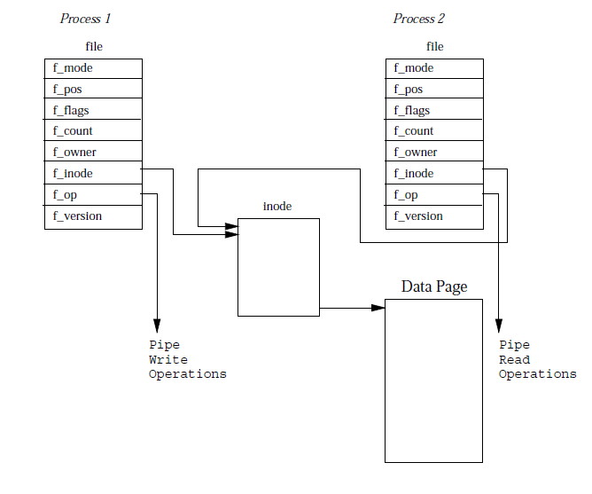
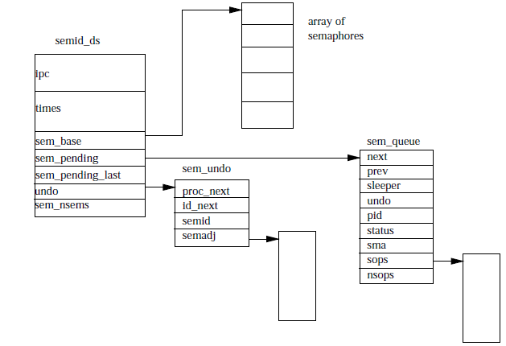
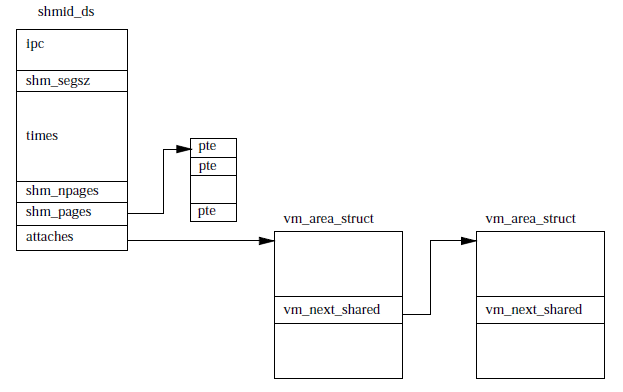

# Interprocess Communication 

## 1. Signals 

Signals are the oldest form of communication allowed on the Unix/Linux platform. Signals allow for
asyncrhonous communication to one or more process. Signals can occure for each stroke on the
keyboard or it can occur due to the process trying to gain access to an invalid virtual memory
address. 

Processes can either choose to ignore the signals completely (except SIGKILL Or SIGSTOP which cannot
be ignored) process can choose to either ignore signal (block them completely and not handle them),
they can have a custom handler to handle the signal or they can use the default handler assigned by
the kernel (default). 

The Kernel cannot handle multiple signals of the same kind on a process i.e. if SIGCONT occurs once
or it occurs 10 times it will  only be handled once by the process.

Kernel and Super users are the process that can send signals to all other process in the system
otherwise any other process can only send signals to processes in the same group i.e. in the same
uid and gid. 

If a process is in the waiting state when the signal is issued the signals are kept in queue against
the process `task_struct` and the kernel sets a signal flag indicating that an interrupt has been
issued. The kernel at this point will also change the state of the process to the running state and
becomes eligible for the CPU time. When a process that has a pending signal gets CPU time it first
checks if any signals are pending and if they are the next instruction set that the process has to
run is the interrupt handler assigned to the signal (custom or default). 

## 2. Pipes 

 

Pipes are a mechanism which the kernel can pass standard output of one process to the standard input
of another process. 

In Linux the the pipes functinality is implemented using the file data structure. When pipe
construct is used the two combining processes are made to point to the same inode (as seen in the
diagram above). The inode that both processes point to is temporary and eventually this points to a
physical page withing memory. 

Both process differ mainly in the f_op attribute, one process will have f_op as write operation
where as the other process will have f_op as read operations. The write process will write bytes to
the shared data page and the read operation will read from the shared memory page. Linux must ensure
that the reader and writer are in sync and do not use locks, waiting queues and signals. 

The writer and reader process use the standard Linux write and read operations to make the
functionality generic. The writer will first look at the shared memory page for locks from the
reader, if the reader has a lock or the shared memory page does not have enough room for holding the
data the writer has then the process is made to sleep on the shared inode's wait queue. 

The reader will send a signal to the writers waiting on the shared inode waiting queue when it has
done its job. Similarly when the writer has a lock while writing is given up when the writer has
done its job and signals wakes up the reader process to read the data from the shared inode. 

Once both the writer and reader are done the shared memory page along with the inode to the shared
page are removed. 

Linux also supports named pipes which are nothing but FIFO structures. FIFO are not temproray
structures like the pipes instead they are actual physical entities on the file system and can be
created using the mkfifo command. 

Linux must handle the readers opening the FIFO before the writers have written to it as well as
readers reading before the writers have writen to the FIFO. Apart from this FIFO act almost the same
way as the pipes do. 

## 3. System V IPC mechanisms 

There are 3 types of system v ipc mechanisms message queues, semaphores and shared memory. The
access to the system v mechanisms is done the same way as access to files is managed.

The data structure that creates a system v object is ipc_perm - this strucutre has group and user id
as well as a object key. The key is a way of locating the object's reference id. There are 2 sets of
keys supported public and private. 

### 3.1 message queues 

Message queues allow one or more processes to write messages, which can be read by one or more
reading processes. Linux maintains a list of message queues, under the **msgque** vector; each
element in the vector points to **msgid_ds** data structure which describes the message queue. 

**msgid_ds** is created each time a new message queue is made and this is added to the **msgque**
structure. Each msgid_ds contains a ipc_perm as well as pointers to all the messages that are
written to this queue. The msgid_ds also contains two queues in the structure one for receiving
messages and one for reading them. 

Each time a process attempts to write or read messages from the queue the effective uid and gid for
the process are compared to the gid, uid for the message queue and access is allowed only if the uid
and gid match. 

The message queue only allows for a limited number of messages on the queue as well as the size of
each message is also restricted. So if a process wants to write a message and there is not enough
space then the process is made to wait on the message queue and will be woken once there is more
space on the message queue. 

Reading from the queue is also similar. If the read process does not get any messages on the queue
it will wait on the message queue till a signal informs it that there is a message on the queue. 

### 3.2 Semaphores 

The use case for semaphores is the following - if you have many coordinating processes reading
records from and too single data file and you want the file access to be strictly coordinated. A
semaphore of initial value of 1 and increment and decrement operations are needed: 

1. The first process that needs to access the file tries to decrement the semaphore value by 1 and
   succeed. Now the semaphore value is 0. 
2. The second process again tries to decrement value of semaphore by 1 and fails because the
   semaphore value cannot be < 0. The second process is put into a waiting queue on the semaphore. 
3. The first process completes is operation (write) and then increments the semaphore by 1 which
   leads to the semaphore value to be 1. At this point a signal to all process waiting on the wait
   queue are sent. 
4. the second process not again tries to decrement value of semaphore and this time succeeds. 

 

### 3.3 Shared Memory 

Shared memory allows communication between processes via memory that appears in all their virtual
address spaces. This data structure is also managed in the same way w.r.t access rights as the
message queues are using keys and ids. 

Once the memory is shared then there is no checks on how the process use them. There needs to be the
use of semaphores to protect the shared memory. The data structure that is used to implement the
shared memory functionality is given below. 

 

Each shared memory are is represented by a `shmid_ds` structure and all `shmid_ds` are stored under
the `shm_segs` vector. The `shmid_ds` determines how big the shared memory structure is and how may
processes are using it. 

Each process that needs to shared the memory area must register its vm_area_struct to the
`shmid_ds`. The vm_area_struct are kept in a linked list that is attached to the shared memory ds as
shown in diagram above. 

Now when a process that has registered with the shared memory structure tries to find a physical
page and is unable to get it will get a page fault which is handled and the physical page for this
fault is assigned to the shared memory. Next time the same page is accessed by another process will
not have to load the page from disk but can get it in shared memory itself. 

[Next](5-pci.md)
