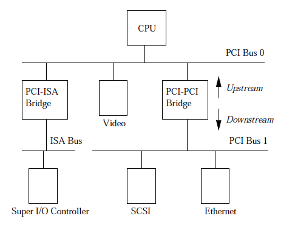
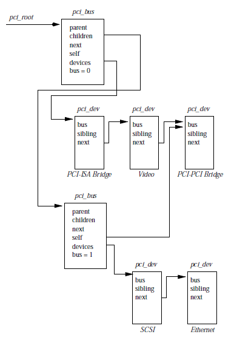

# PCI - Peripheral Component Interconnect 

The following diagram shows the typical architecture of how PCI is set up. 

* The PCI buses and the PCI-PCI bridge are the components that end up brining all the system
  together. 
* The CPU is connected to the PCI bus 0 (primary PCI bus) as is the video device. 
* A special PCI device, PCI-PCI bridge connects the primary PCI bus with the secondary PCI bus 1. 
* The secondary PCI bus 1 is conntected to devices like SCSI and ethernet devices. 
* Generally the two PCI buses, along with the bridge and the two devices (SCSI and ethernet) are all
  on the same PCI card. 
* There is another ISA bus that is conncted to the primary PCI bus 0 using a PCI-ISA bridge device.
  The ISA are legacy devices that the system may want to connect to like keyboard, floppy, and
  mouse. 

## 1. PCI Address Space 

In order for the CPU to control the devices and coordinate between the device and the other parts of
the system there is a need for a shared memory (address space) that the CPU can share with the PCI
devices. The shared memory is used to keep registers, control information and state of the devices
in question. 

The peripheral devices do not have direct access to system memory for security reasons (for example
a rogue device can cause problems on system memory). The CPU generally acts as intermediary between
the PCI devices and the system. However there is a way the peripheral devices can access the system
memory directly and that is done using the DMA (direct memory access) channels under the strict supervision.

## 2. PCI Configuration Header 

Every PCI device including the the PCI bridge have a configuration data structure that is somewhere
in the PCI configuration address space. This header allows system to identify and control the
device. 

The location of the configuration header in the address space depends on which slot on the PC
motherboard. The configuration header for PCI is shown in the diagram below: 

 

The following are the fields in the PCI header (256) 
* vendor id - this identifier describes the originator of the PCI device. e.g. for intel the device
  id is 0x8086. 
* device identification - unique number identifying the device in the system. 
* status - signifies the status of the PCI device. The status of the devices are defined in the PCI
  local bus specs. 
* Command - this is the field used to control the device. 
* Class code - identifies the type device that this is. There are standard classes for each type of
  device e.g. SCSI, video etc. 
* Base Address Registers - This is used to determine and allocate the type, amount and location of
  the PCI I/O and PCI memory space that the device can use. 
* Interrupt PIN - these pins on the PCI card carry interrupts from the card to the PCI bus. 
* Interrupt Line - This is used to pass an interrupt handle between PCI initialisation code, the
  device driver and Linux interrupt handling sub system. 

## 3. PCI I/O and PCI memory address 

These are address spaces that are used by the PCU device to communicate with the device drivers
running in the Linux Kernel. 

The device drivers control the device using these address spaces by passing commands to the command
files in the header. e.g. video drivers typically use large amounts of PCI memory space to contain
video information. 

## 4. PCI-PCI Bridge 

PCI-PCI bridges are special PCI devices that connect/glue the PCI buses together. There is a
electrical limit to how many devices that the PCI buses can support therefore to increase the number
of PCI devices the use of PCI-PCI bridges has become common. Due to this reason more PCI buses and
hence more PCI devices can be added to the system. This is crutial for the high performance servers. 

### 4.1 PCI i/o and PCI Memory windows

The PCI bridges are smart and inoder to reduce the propagation of addresses all over the system,
they can be programmed to only send the requests down to other buses if needed only. This reduction
of the data flow across buses into a window controls the flow of data. 

## 5. PCI Initialization 

The PCI initialization has 3 different steps: 

1. PCI device drivers - this pseudo device driver searches that PCI system starting from bus 0 and
   locates all PCI buses and the PCI bridges attached to the main bus. This will then create a
   linked list data structure of all the devices connected to bus 0. 
2. PCI Bios - this has ROM related software that is done to configure the i/o functions. 
3. PCI Fixup - this piece of software tidies up the system specific loose ends of the PCI
   initialization. 

## 6. PCI data structure 

The PCI data structure has two main structures pci_bus (bus) and pci_dev (device). The entire
structure starts with the pci_root structure that points to the first first pci bus (bus 0) in the
PCI architecture. 

pci_bus strucutre is linked to pci_dev which can either be PCI-PCI bridges, PCI-ISA bridges or plain
old devices like SCSI and ethernet. The pci_bus also points to the next pci bus as well so that we
can get to the bus 1 also from bus 0 structure. 

 

[Next](6-interrupts.md)

