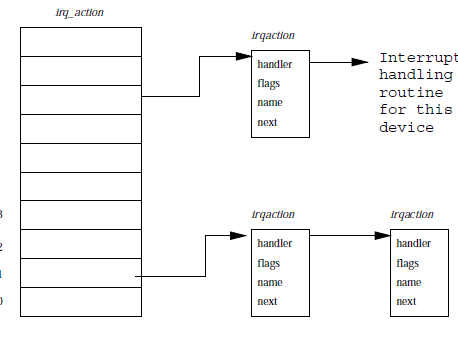

# Interrupts and Interrupt Handling 

Systems often use interrupt controllers to group device interrupts together before passing on the
signal to the single interrupt pin on the CPU. The interrupt controller has mask and status
registers that control the interrupts. setting the bits on the mask register enables or disables the
interrupts and status register returns the active interrupt in the system. 

The handling of the interrupt in principle is same in a lot of cases: 

1. When a hardware interrupt occurs CPU stops processing instructions and jumps to locaion in memory
   that holds the interrupts handlers code. 
2. The handler code is run in a special mode called interrupt mode. Normally no interrupts can
   happen at this point in time.
3. However an interrupt can be interrupted when the system support hierarchy in the interrupts as
   well but that is generally not the case with all systems. 
4. Some CPU's have special registers that handle only the interrupt code. 
5. Once the interrupt handler has been executed the CPU returns to the process that it was running
   at the time the interrupt occured. 

## 1. Interrupt Handling 

The main function of the interrupt handling system is to route the interrupts to the right piece of
interrupt handling code. If, for example, the floppy controller interrupts the interrupt controller
on pin 6 then the sub system must recognise that the interrupt if from floppy and route to the
correct interrupt handling code. Linux uses a set of pointers to point to data structure that haave
access to the error handling code. 

The interrupt handling data structures are show in the diagram above. The irq_action is a vector
that holds the reference to the irqaction structures and each of the irqaction ds are the ones that
have specific interrupt handling routine. As the handling of interrupts is architecture specific
therefore the data structures irq_action and irqaction vary based on the architecture that are used
in the system. 

When a device driver's interrupts handling routine is called the kernel must work out why the
interrupt occured and respond appropriately. The device driver is asked by the kernel to look into
the device's registers to figure out the reason. Eventually the kernel will call the interrupt
routine and return control to other process to work. 

[Next](7-device-drivers.md)
