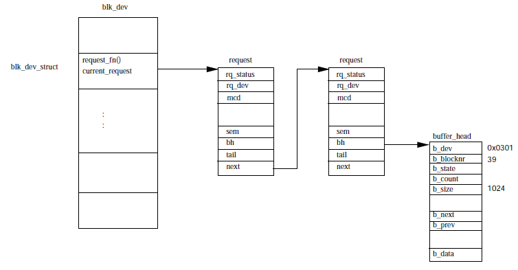

# Device Drivers 

The CPU is not the only component on the computer that is intelligent. All physical devices on the
computer have a controller with some bit of memory and register to do some processing on its own.
E.g. SCSI has a SCSI controller and keyboard too has its own controller. 

Each of the physical devices on the system are managed by the software which is part of the Linux
kernel which is called the device driver. 

Every device on the Linux system is represented by a device special file which looks similar to a
file on the OS. All devices controller by the same device driver have the same major device number
but are differ in minor revision number. Linux supports 3 kinds of hardware devices: 

1. character - these devices are written to or read from directly without the involvement of the
   buffer. e.g. is serial ports on the computer. 
2. block devices - these are devices that are written to or read from in blocks of 512 or 1024 byte
   chunks. These are devices that generally go through a buffer in order to do their operations.
   The example being hard disks. These devices are accessed via the file system. Also only block
   devices can support a mounted file system. 
3. network devices - these are accessed using BSD sockets and the networking sub system. 

The main attributes of device drivers are: 

* kernel code - the code of the device driver becomes part of the kernel therefore it must be
  written carefully to avoid it from harming the entire OS and hardware. 
* kernel interface - each device driver must provide a standard interface that the kernel will use
  to interface with it. Interface can be either a file i/o or a buffer cache interface. 
* Kernel mechanism and services - the device drivers use kernel services and data structures like
  wait queues and memory allocation service etc to work efficiently. 
* Loadable - the device drivers are loaded into the kernel as modules. This architecture allows the
  kernel to get ride of device driver module that are not used by the kernel. 
* dynamic - As the system boots up it loads the device driver which simply checks whether the device
  is present or not, if the device is absent the kernel just ignores the device and the driver and
  continues it work. 

## 1. Polling and Interrupts 

When a command is given to a device. The device driver has a choice as to how it finds out that the
command is complete. There are two ways this can be done: 

* polling - here the device drivers, at regular intervals (determined by timers), will poll the
  status register on the device to figure out the completion status. This mechanism is approximate
  at best because of the use of timers which can be delayed based on how the OS is processing.
* interrupts - another mechanism is to use interrupts. Here the hardware device will raise an
  interrupt everytime it needs to be serviced. It is up to the kernel to call the device driver as a
  response to the interrupt. This is achieved by register an interrupt that the device will throw
  with the kernel and the handler must call the device driver to go the needful. The interrupts that
  are registered on the system can be seen under /proc/interrupts. 

An example of this approach is when the ethernet controller will raise an interrupt each time it
recevies an internet packet and that interrupt is processed by a routine on the device driver end
which is specialized code to handle pakcets form the internet. 

## 2. Direct Memory Access 

Using interrupts as a mechanism to handle data transfer with a device driver can be a good strategy
when the transfer rate is slow. When the data transfer rate is a lot higher either on the ethernet
side or the SCSI disk level there is a need to have a different strategy as the interrupt based
approach will be prohibitive from a performance standpoint. 

The alternate is called direct memory acess (DMA). The DMA controller allows the system to transfer
data to and from the device to the system memory without it ever being sent to the CPU. The data
transfer is initiated when the device driver sets up DMA channel and count registers along with the
direction of the data read or write. Once the data transfer is complete the device will interrupt
the PC. During the data transfer the CPU is free to do other stuff. 

Points to remember with DMA controller: 
1. DMA controller knows nothing of the virutal memory, it only has access to physical memory.
   Therefore memory that is being DMA'd to or from must be a contiguous block of physical memory.
   This means you cannot DMA directly to a processes virtual address space. You can however lock the
   processes physical pages so that they are not swapped out till the DMA operations are done. 
2. DMA cannot access the entire memory. The DMA can access the botton 16 Mbytes of memory. 

Linux tracks the DMA channels using the dma_chan data structure. This has two fields: 
1. pointer to the name of the owner of the DMA channel. 
2. flag indicating if the channel is in use or not. 

## 3. Memory 

Because the device drivers are part of the kernel they do not have access to the virtual memory and
therefore all the data and structure they such are in the physical memory. Linux provides the
allocation and de-allocation routines for memory and they are the ones used by the device drivers to
do the memory management they need. 

Linux allocates the kernel memory in chunks of 128, 512 or 1024 bytes and even if the memory
requirement may lie in between the allocation is done in discrete values. If the free memory is low
there may be a need to discard the page or swap it out. In the case of low memory 2 things can
happen: 

1. The Kernel will put the process into wait queue until enough memory is present in the system. 
2. The kernel may fail the process that is requesting memory because the process may not want to
   wait for the memory to be free and fail fast. 

The device drivers can also specify to the kernel that they require DMA access. Therefore the
process is marked as DMAable and this abstracts from the device drive process how DMA is done. 

## 4. Interfacing Device Drivers with the Kernel. 

The idea behind the common interface for all the different kind of device drivers is to have the
diverse devices behave the same way to the kernel. this allows the kernel code to be simple leaving
the complexity of the implementation to the driver level. e.g. IDE and the SCSI are two different
devices but the Kernel behaves in the same way towards them both. 

Linux kernel provides two ways in which the device drivers can be included into the kernel. 

1. The device drivers are included as part of the kernel code and are registered with teh kernel at
   boot time using the configuration scripts. At boot time the kernel will look for these device
   drivers when they encounter a device for them. 
2. The device drivers can also be loaded in th kernel at the time when the kernel discovers a device
   for which the module is needed. 

Linux keeps a list of all the device driver modules and codes in a data structure which includes
pointers to the initialization routines, configurations as well as info about the class of the
driver. 

### 4.1 Character Devices 

Character devices are accessed as files. Applications use standard system calls to read, write and
close the files. As a character device is registers itself with the Linux kernel by adding an entry
into the chrdevs vector which points to device_struct data structure. 

Each device special file is represented as a VFS inode. The VFS inode has the information needed by
the kernel to interact with the device. Also the inode plugs right into the file system that is used
for a partition. 

Each VFS inode is associated with it a set of file operations and these are different depending on
the file system object that the inode represents. 

### 4.2 Block devices 

Block devices also support being accessed as files. The data structure for block device are given in
the diagram below: 

 

The block device data structure is similar in structure to the character based devices but block
devices are classified into types e.g. SCSI and IDE belong to two different device types. It is the
class of the device that registers with the Kernel and then decides the operations taht the driver
will provide. 

Every block device must provide an interface to the buffer cache as well as the normal file system
operations interface as well. The blk_dev_struct is the data stucture that represents a block device
and is indexed based on the major verison. The blk_dev_struct has the following information: 
1. pointer to the request routines that can be used. 
2. pointer to the list of request data structures. 

The entry into the request linked list is an operation on the block device that needs to be
performed i.e. either data needs to be read or written to the block device. All operations are
performed via the buffered cache that holds the cache value of the data that we are seeking. 

Each time a buffer cache wishes to read or write to the block device it adds a request object to the
blk_dev_struct. Each blk_dev_struct pionts to the buffer_head data structure which is the one that
actually allows for the operations (read or write). 

Once the device driver has completed the request it is removed from buffer head. The unlocking of
the buffer_head wakes up other processes that have been waiting for this operations. 

## 5. Network Devices 

A network device on Linux is an entity that sends and receives packets of data. This is generally a
physical device like the ethernet card. Some devices like loopback are network devices defined in
software. Each network device is represented by a device data structure. 

The information of the network device are stored in device data structure. The device struct holds
inforamtion of the device as well as pointers to the functions that allow the use of network
protocols to use with the device. 

All network data (packets) are transmitted using the sk_buff struct which is a flexible structure
that allows for network headers to be easily added and removed. The device data structure contains
the following information: 

* Name - unlike character and block devices that can be created using mknod command, the network
  devices appear dynmaically when the device is dicovered and made operational. The devices can be
  like: 
  	* /dev/ethN - ethernet device 
	* /dev/slN - SLIP device 
	* /dev/pppN - PPP device 
	* /dev/lo - loopback devices. 

* Bus information - this have irq number, base address and DMA channel number that network device is
  using. 

* Interface Flags - 
	* IFF_UP - is the device up and running. 
	* IFF_BROADCAST - broad cast address in device is valid. 
	* IFF_DEBUG - device debugging turned on. 
	* IFF_LOOPBACK - this is a loop back device. 
	* IFF_MULTICAST - multi cast address. 

* Protocol Information - 
	* mtu - this is the size of largest packect that the network can transmit not including the
	  link layer headers. This value is used by the protocol layer (IP) to decide the size of
	  the packet to send. 
	* Family - this signifies the protocol family that the device supports. All Linux network
	  devices are of the AF_INET family. 
	* Type - This signifies the hardware device interface that the device is attached too. The
	  supported devices are X.25, token ring, slip, PPP and Apple Localtalk. 
	* Address - The device data structure holds the address (IP) that are relevant to it
	  including its own. 

* Packet Queue - this is the queue of sk_buff packets that are queued on the device which need to be
  transmitted. 

### 5.1 Initializing the Network devices 

There are two problems to be solved for network device driver initialization: 

1. Not all network drivers will have have devices to control because these devices may not be
   attached to the device at all. This problem is solved by having the device driver return a value
   indicating whether the device was found or not. If the answer is no then device driver reference
   form the device data structure is removed. 
2. The devices have to be named /dev/ethN no matter what device driver is present. There are eigth
   device standard entries into the device list; eth0 .. eth7 and the initialization routine is the
   same for them all. The routine will try each device driver and see if it fits the device on the
   ethN. If it does then the ethN is marked as taken and a relevant driver is assigned. If all ethN
   are taken the initialization routine stops. Therefore could be a situation that only one or two
   of the device drivers may be taken out of the possible 8. 

[Next](8-file-system.md)

