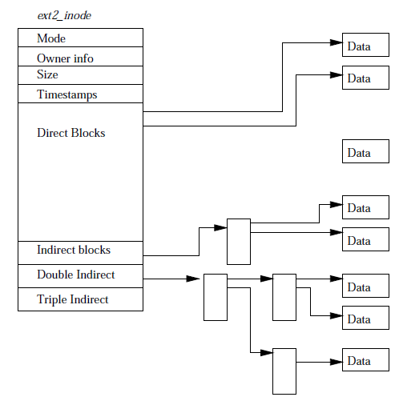
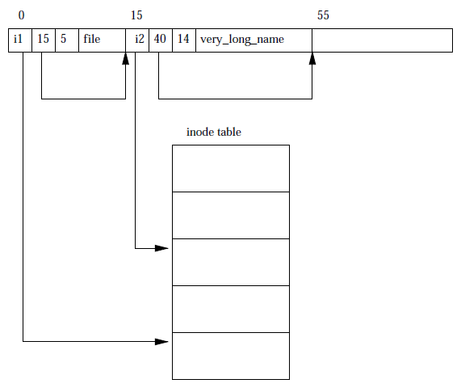
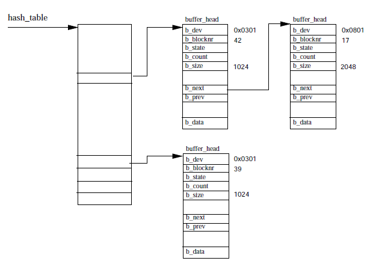

# The File System 

One of the most important features of Linux OS is the support for multiple file systems. Some of the
popular ones are ext, ext2, xia, minix, umsdos, msdos, vfat, proc, smb etc. 

Linux just as Unix does not identify file systems with a device id or name. Instead all the file
systems are presented under the same hierarchical tree structure as a single unit. As new file
systems are mounted they are done so under the single tree structure. The directory 
on which the file system is added/mounted is called the mount point.

When a disk is initialized (using fdisk) a logical partition structure is imposed on the disk. Each
partition so defined may hold a single file system e.g. ext2. The devices that can hold file system
are called block devices. 

The Linux file system regards a block device as a linear collection of blocks, they do not know or
care about the underlying physical disk geomerty. The task of translating the block to the right
track, sector and cylinder on the disk is the job of the device driver. The main requirement from a
file system is that it must look, feel and operate in the same way no matter what device is holding it. 
Moreover it does not matter whether the file system are on different physical media or are
controlled by different hardware controllers. 

With the introduction of the ext system the real file system was separated from the OS and system
services by the use of VFS (virtual file system). This allows Linux to support the myraid of File
system out there using the same interface as the VFS. This is what allows different file system in
the same way. 

The main concerns that comes into the picture when VFS is used is the concept of buffer cache that
us used to keep data in memory for faster retrieval but this can cause issues with how the FS is
maintained specially when writes are written to the cache etc. 

## 1 Extended File System 2 (ext2) 

Ext2 is the most popular among all the linux file system as it is widely used. ext2 like all other
file system assumes that that data written to the file system will be in the form of data blocks. 

In ext2 the file and directories are denoted by the inod data structure that is given below: 

 

As far as file systems are concerned data is simply written or read in the form of blocks and the
file system is not bothered where this block will be written on the disk that is the concern of the
device drivers. 

The ext2 file system divides the file into partitions that it occupies into block groups. The group
duplicates information critical to the integrity of the file system as well as holding real files
and directories as blocks of information and data. 

### 1.1 ext2 inode 

Each inode on the ext2 file system contains the following information: 
* mode - This provides two pieces of information one is the type of the inode (file, directory,
  symbolic link, block device, character device or FIFO. Two the persmissions the user has on the
  current inode. 

* owner information - this defines the user and the owner of the file system. 

* size - gives the size fo the file in bytes. 

* Timestamps - The time the inode was created and the last time sort and the last time it wad
  modified. 

* Data blocks - these are pointers to the actual data blocks where the data recides.
	* first twelve pointers are direct pointers to the data block. 
	* indirect block has one leve indrection 
	* double block has a double indirection 
	* triple block has a triple leve of indirection. 

Therefore accessing the first 12 blocks of a file will be very fast as we have only one level of
indirection. 

### 1.2 ext2 superblock 

The ext2 superblock contains meta information about the file system like the basic shape and size of
the file system. This information is used by the system to manage the file system better. The
superblock is generally kept in group block 0 which is the first block read when the file system is
mounted. The information that the ext2 FS contains are: 

* Magic number - This is the number that allows the mounting software to know taht this is the ext2
  file system currently the magic number of 0xEF53 
* Revision level - this is used to determine which features of the file systen can be made available
  based on the revision number of the file system. 
* Mount count and max mount count - together these values help us determine whether the file system
  needs to be fully checked. 
* Block group number - 
* Block size and Blocks per group 
* Free blocks
* Free Inodes 
* First Inode - Generally teh first inode should be ideally be the reference to the root (/) 

### 1.3 Directories 

Directories are special files that are used to create and hold access path to the files in the file
system. A directory file is a list of directory entries, each cotnaining the following information: 

* inode - The inode for this directory entry. This has an index into the inode table. 
* name length - the length of directory entry in bytes 
* name - name of this directory entry

The first to entries to all the directories are the same and they are '.' current directory and '..'
parent directory. 

 

### 1.4 Changing the size of file on ext2 

When a process attempts to write to a file the file system checks to see if there are enough free
blocks left with the file. If the file system finds that there are not enough blocks to write the
data it will try and find more blocks to write data. During the time when the file system is looking
for new blocks the super block of the file system is lock which prevents other process from writing
to the file system. 

If the file system finds no free blocks it will do the following checks and executions: 
1. if there is no free block then check for preallocated blocks (setting that an be done on the FS)
  and assign them if they are available. 
2. on the other hand if the preallocated blocks are also not found then the kernel has to assign the
   block. 
3. The file system first tries to see the neighbouring physical locations for free blocks. If there
   are enough free blocks then new blocks are placed next another. 
4. If neighboruing blocks are also not free then the file system broadens the search and looks for
   block that may by 64 blocks radius. 
5. When a new free block is being assigned it is done so with a collection of 8 free blocks to avoid
   too much fragmentation. 

Finally the file system marks the buffered cache entry for the current file as dirty and this also
leads to the super block being marked dirty and this is kept this way till the actual data is
written to the physical file system. 


## 2. Virtual File System (VFS) 

 

VFS has been generated as a general abstraction for all the file system that Linux supports. The
data structure of VFS is the same as the ext2 file system is general. VFS too has superblock and
inodes structure that will eventually map to the ext2 or other file system inode or superblock. 

When a file system is loaded at the time if initialization of the OS it will register the file
system and use its device driver to help with read and write operations. 

VFS keeps a list of loaded file systems along with the reference to their super block. The
superblock has a lot of information apart for the pointers to various routines of the operations
that the process can perform. 

The processes on the other hand will traverse the VFS rather than the actual file system but once
the file that you are intrested in found it is acccess using the actual file system implementation. 

The VFS uses buffered cache to cache recently accessed data. This buffered cache is independent of
the file system that is being used. This is made possible because the block structure is uniform
across all file systems. When the file system read a block of data it is read into the buffered
cache and then served further this allows for data to be served if it is in cache. On the other hand
there are a few file system that allow for read ahead access where the file system on speculative
bases reads the data that may not have been asked for. 

VFS also used **directory cache** that allow for popularly accessed directory information to be made
avaiable quickly. This cache maps full directory names with the inode identifiers. 

### 2.1 VFS superblock 

The superblock contains the following information apart from other data as well: 

* Device - the identifier of the device on which this file system is mounted /dev/hda1
* Inode pointer - This points to the inode pointer at represents the first inode of the mount point.
  The root file system VFS does not have this covered pointer. 
* Block size - 
* super block operations - these mainly include operations like reading and writing to files. 


### 2.2 VFS inode 

Like the ext2 file system, every file, directory and so on in the VFS is represented by one and only
one VFS inode. This information for the VFS inode comes from the inode information in the file
system structures. VFS inode are present only on the kernel memory and are kept as long as they are
relevant. The information the VFS inode holds are: 

* device - device on which the inode is prepared. 
* inode number - this is unique within the file system. The combination of device and inode number
  makes the identifier unique in a server. 
* User ids - owner ids of the file. 
* times and blocks size 
* inode operations - these are pointers to routine that will run when basic operations of the file/
  directory or other files need to be done. 
* lock - used to lock the file system node during operations. 
* file system specific information. 


### 2.3 Mounting a File system 

The mounting of a file system is done using the mount command: 

```
$ mount -t iso9660 -o -ro /dev/drom /mnt/cdrom 

```
The first check that the kernel does it to find out if the file system being mentioned is actually
supported by the kernel or not. Also it checks to see if the proposed mount point is present or not. 

1. The first thing VFS does is to get the filesystem. This is done by looking at the file_system
   data structure, the VFS goes through each one of the supported FS and tries to find the one that
   matches. 
2. If the file system is not found in already built in file system supported the VFS will look for
   modules that can be loaded to support this FS. 
3. Now VFS checks of the physical device passed to the mount command is not already mounted and
   finds the mount point on the file system specified. 
4. Once the mount point has been decided the VFS checks if there is another mount point already
   mounted at the location (there can be only only mount point per directory) 
5. Next the VFS will allocated a superblock and pass it information from file system. The super
   block (VFS) is kept under the super_blocks data structure. This data structure is arranged such
   that it can be retrieved quickly. 


### 2.4 Unmounting the File system 

In order to unmount the file system there are some prequisites and the most prominant among them is
that if any file in the diretory is still in use by another process. E.g. if the VFS inode is dirty
i.e. it is waiting to be written to disk. 

Once the inodes are all done with the job they can be put back into the pool. Finally the vf_mount
data structure for this mount is unlinked and freed. 


### 2.5 Other caches 

There are two other caches that the VFS structure uses: 
1. inode cache - this cache is used to fasten the process of finding inodes. 
2. directory cache - this is a cache for diretory entries. 

All these caches us LRU algorithm to get ride of unnecessary cache entries in this company. 


## 3. Buffered Cache

As block devices are read the data is served by the device driver to the kernel in the form of
buffer_head data structure via standard kernel routines. The block of data is identified by the
device id and the block number. To be efficient with the way Linux performs i/o operations the
kernel looks for data in the buffer cache before it tells the device driver too look for the data
from disk. The buffer cache is shared between all of the physical block devices. 

There are two functional parts to the buffer cache: 

1. list of free block buffers - the blocks can be either be on the list when it was first created or
   when memory is freed from the block buffer. 
2. second is the cache itself and the data structure is that of a hashtable where each entry in the
   hash table is a linked list of buffer blocks that have the same hash index. 

The diagram below shows how the buffer blocks are arranged in the buffer cache. 

 

When the block buffer is in the buffer cache it is also part of the LRU (least recently used) list
as well. There is a LRU for each buffer type and Linux supports the following buffer types: 

* clean - unused, new buffer 
* locked - buffer that are locked, waiting to be written. 
* dirty - dirty buffer, valid or new data but they will be written to in the near future. 
* shared 
* unshared 

Here is the workflow of how the operations to access blocks happens in block devices. 

* When the system tries to read data from underlying physical device, it trys to get block from the
  buffer cache. 
* if the system does not find the block in buffer cache it will get a free block from the free list
  and ask the system to read the block into the new buffer block and adds it to the buffer cache. 
* similar operations take place when the block is in cache but might not have the latest data
  therefore the system may have to get the block from disk again. 

The daemon that maintains the buffer cache is called bdflush kernel daemon. 

### 3.1 bdflush Kernel Daemon 

bdflush daemon is a kernel process that provides dynamic response to the situation where the system
has too many dirty buffers (the blocks have to be written to disk). This daemon/process is started
at the time of kernel start up and mostly the daemon waits and sleeps till the dirty blocks reach a
threshold which is 60%. However the bdflush can also be called independently before the threshold is
reached. This can be done using the update command 

```
$ update -d 
```

### 3.2 /proc file system 

/proc file system really shows the power of the virutal file system because the file system is
exclusively virtual. Neither the /proc directory nor the sub directories actually physically exist. 

The /proc file system actually registers itself with the virtual file system, however when the
request for the /proc files and directories are made the /proc file system will generate the entries
based on the state the kernel is in currently. e.g. the /proc/devices is generated from kernel's
device data structure each time it is listed or cat. 

### 3.3 Device special files 

All devices (hardware) are presented to the user as device special files. therefore the /dev/null
file represents the null device. The device special file does not hold any space on disk as it is
just an access point for the device driver to get to the actual device. 

When the i/o request is made to the device file, it is forwarded to appropriate device driver within
the system (often this device driver is also a pseudo one). 

[Next](9-networks.md) 
